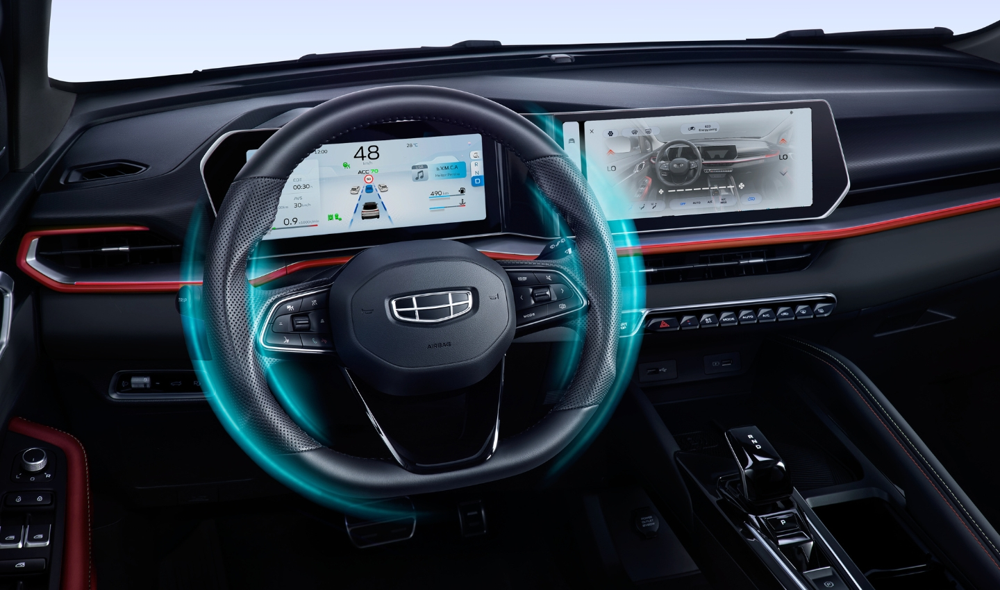

**Using this software may potentially harm your car’s infotainment system. I assume no responsibility for any damage resulting from its use**

# Geely Coolray SX11-A3
# Infotainment system update to include Apple CarPlay.

A repo which has a version of Geely Coolray SX11-A3 infotainment system update bringing Wired Apple CarPlay function.
Usually, this model called Coolray facelift which introduced to some counties at the end of 2023 and the beginning of 2024.

The file has been found shared in one of Telegram groups. 

here is how the car looks like to differentiate from older models.

here is how the infotainment looks like

**Important notes**

 - I think the Firmware is official and not modified.
 - the firmware tested on a cars released in middle east and the infotainment was originally comes with multiple languages including English and Arabic and was **not in Chinese**. 
 - i have tested it myself on my own car which infotainment system originally has software version number ending with `00235`
 - After upgrade the software it shows software version`00193`

You can download the firmware and the PDF guide from this [Link](https://mega.nz/folder/4G0FiSJI#kYSL5spvA3UpBz8xa4nmcg).

if anyone can help and support of modifying the update file to inject other APK file to be installed during the upgrade please contact me.
